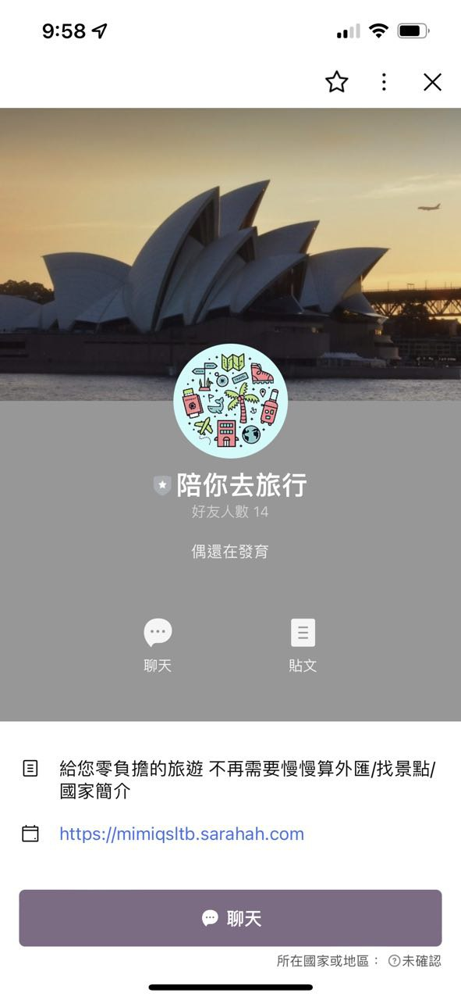

# Line Currency Bot
> 此機器人主要提供匯率轉換功能，使用的是台灣銀行官網資料，每2小時更新一次。

<br />

## Technology
> 核心使用技術

以`thread`的方式，每2小時利用`pandas`的`readhtml()`讀取匯率資料，`main-thread`運行機器人主體，並會針對使用者作`jieba`分詞以及詞彙替換，讓使用者不必刻意按照特定的指令格式也可以用簡單的方式取得匯率換算，尾巴加上`$`即可取得美元價格。

範例: 
```
1234 AUD=, 1234 澳幣=, 1234澳元= $
```

<br />

另外也可以使用連加功能類似購物車的方式輸入。

<br />

```
1234 + 2234 + 3234 + 韓元=, 100 + 200 + 300KRW=$。
```

<br />

針對無意義運算例如台幣換台幣是有設置小彩蛋的歐!

<br />

## Demo

### 主頁


<br />

### 聊天室


<br />

### 天氣


<br />

### 筆記本


<br />

### 匯率功能
https://user-images.githubusercontent.com/102388049/182193626-9ce0acca-a9ff-43ea-8826-c1fe43c1f7d9.mp4

<br />

## Set up

``` sh
pip install -r requirements.txt
```

<br />

將`configs_.json`更名為`configs.json`，之後寫入下方教學告知如何取得的參數，請勿直接照下方教學的方式將任何密鑰直接寫入`settings.py`，除非你知道風險以及知道怎麼做。

``` json
{
    "SECRET_KEY": "",
    "LINE_CHANNEL_ACCESS_TOKEN": "",
    "LINE_CHANNEL_SECRET": "",
    "ALLOWED_HOSTS": []
}
```

其餘步驟請參考[Line Bot 教學](https://www.learncodewithmike.com/2020/06/python-line-bot.html)，因為還需要API KEY、Webhook URL、Secret KEY...等，內有詳細建置說明。

<br />

## Room for Improvement
> 將原本的同步伺服器架構改為非同步。

開發此機器人時，本人還是個python初學者，現在有能力將機器人改以非同步的架構運行，打算利用本庫的開發者可以考慮更改架構以促進效能，特別是爬蟲改以[pyppeteer](https://github.com/pyppeteer/pyppeteer)運行能大幅提高速度，前提是必須使用非同步伺服器架構。

<br />

## Reference

- ##### [Line Bot 教學](https://www.learncodewithmike.com/2020/06/python-line-bot.html)
- ##### [Django](https://github.com/django/django)
- ##### [Jieba 結巴](https://github.com/fxsjy/jieba)
- ##### [Pandas](https://github.com/pandas-dev/pandas)

<br />

## License

[MIT](LICENSE)
